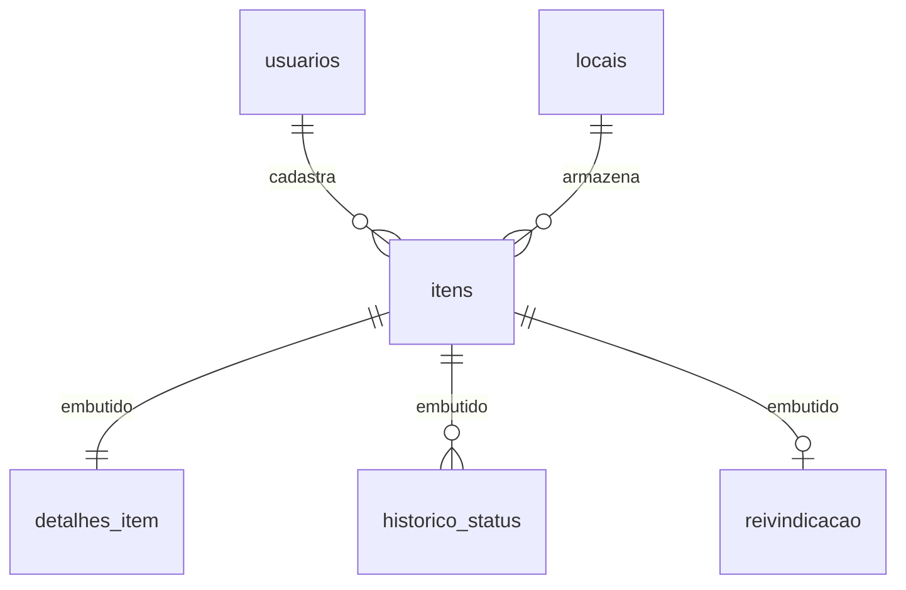

# Relatório Técnico: Sistema NoSQL de Achados e Perdidos (UniFind)

**Disciplina:** Bancos de Dados NoSQL  
**Tecnologias:** MongoDB, Redis e PHP 8.2  
**Integrantes e Divisão de Atividades:**
- **Integrante 1 (Modelagem & MongoDB):** Delimitação do cenário, modelagem de coleções, documentos embutidos vs referências, scripts de inserção `01_dados.js`, CRUD e elaboração do Aggregation Pipeline.
- **Integrante 2 (Redis & Integração PHP):** Definição de estruturas e chaves Redis, implementação do fluxo de cache com TTL, protótipo web em PHP com Docker Compose e testes de demonstração.

---

## 1. Descrição e Delimitação do Cenário

O **UniFind** é um sistema centralizado de achados e perdidos desenvolvido para atender ao campus universitário. O problema abordado é a perda recorrente de pertences pessoais de estudantes e servidores (notebooks, carteiras, chaves, vestuário e garrafas térmicas) em diferentes pontos físicos do campus (Biblioteca Central, Blocos de Aula, Restaurante Universitário, Ginásio e Portaria).

### Delimitação do Escopo:
O projeto concentra-se em:
1. **Recepção e Catalogação:** Registro detalhado de objetos com categorização, fotos/características e valor estimado.
2. **Localização Física:** Vinculação dos itens a postos de atendimento guardiões no campus.
3. **Fluxo de Reivindicação e Devolução:** Gestão de pedidos de restituição com fila de validação administrativa.
4. **Resumos Estatísticos:** Relatórios consolidados por categoria de itens e ranking em tempo real dos locais com mais perdas.

---

## 2. Modelagem das Coleções e Documentos (MongoDB)

O MongoDB foi escolhido como banco de dados principal para armazenamento permanente dos registros.



### Justificativa da Estratégia de Modelagem:
- **Documentos Embutidos:**
  - `detalhes_item`: Atributos como cor, marca, número de série e tags foram embutidos pois são lidos e atualizados exclusivamente em conjunto com o documento principal do item.
  - `historico_status` (Array embutido): Permite auditoria completa das trocas de estado do item sem a necessidade de joins com tabelas externas de log.
  - `reivindicacao`: Dados da solicitação de posse do objeto ficam embutidos no item para consulta direta.
- **Referências por ObjectId:**
  - `local_id` (referenciando a coleção `locais`): Mantém a fonte única de verdade sobre contatos e horários de funcionamento do posto de armazenamento.
  - `cadastrado_por_usuario_id` (referenciando `usuarios`): Garante consistência cadastral dos servidores/estudantes responsáveis pelo registro.

### Exemplo de Documento Real da Coleção `itens`:
```json
{
  "_id": { "$oid": "65c300000000000000000101" },
  "titulo": "Notebook Dell Inspiron 15 Prata",
  "descricao": "Notebook deixado na bancada de estudos do 2º andar da biblioteca.",
  "categoria": "Eletrônicos",
  "status": "encontrado",
  "valor_estimado": 3500.00,
  "data_registro": "2026-08-01T14:30:00Z",
  "local_id": { "$oid": "65c200000000000000000001" },
  "cadastrado_por_usuario_id": { "$oid": "65c100000000000000000005" },
  "detalhes_item": {
    "cor": "Cinza Prata",
    "marca": "Dell",
    "numero_serie": "SN-DELL-998822",
    "tags": ["notebook", "dell", "computador", "prata"]
  },
  "historico_status": [
    {
      "data": "2026-08-01T14:30:00Z",
      "status": "encontrado",
      "usuario_id": { "$oid": "65c100000000000000000005" },
      "observacao": "Item entregue por um estudante na recepção."
    }
  ],
  "desativado": false
}
```

---

## 3. Consultas, Aggregation Pipeline e Índices no MongoDB

### 3.1 Operações CRUD e Consultas com Operadores
1. **Filtro por Faixa de Valor (`$gte`, `$lte`):** Localiza itens eletrônicos ou de alto valor entre R$ 200,00 e R$ 4.000,00 para controle de segurança.
2. **Filtro por Conjunto de Categorias (`$in`):** Filtra objetos críticos como `["Chaves", "Documentos"]`.
3. **Busca Textual Regex (`$regex` com `$options: "i"`):** Busca insensível a maiúsculas/minúsculas no título ou marca (ex: `Dell`, `Sony`, `Apple`).
4. **Consulta em Embutido (Notação Ponto):** Identifica itens com solicitações pendentes (`reivindicao.status_reivindicacao: "pendente_aprovacao"`).

### 3.2 Aggregation Pipeline (4 Estágios)
O pipeline consolida métricas financeiras e volumétricas por categoria de objeto:
```javascript
db.itens.aggregate([
  { $match: { desativado: false } },
  {
    $group: {
      _id: "$categoria",
      total_itens: { $sum: 1 },
      valor_total_estimado: { $sum: "$valor_estimado" },
      valor_medio: { $avg: "$valor_estimado" }
    }
  },
  { $sort: { total_itens: -1 } },
  {
    $project: {
      _id: 0,
      categoria: "$_id",
      total_itens: 1,
      valor_total_estimado: 1,
      valor_medio_formatado: { $round: ["$valor_medio", 2] }
    }
  }
])
```

### 3.3 Criação e Benefício do Índice
- **Índice Criado:** `db.itens.createIndex({ status: 1, categoria: 1, data_registro: -1 })`
- **Justificativa:** A busca por itens "encontrados" de uma categoria ordenados por data recente é a consulta mais requisitada da plataforma. Com o índice composto, a consulta passa de um scan completo em coleção (`COLLSCAN`) para uma busca indexada em B-Tree (`IXSCAN`), zerando a necessidade de ordenação em memória (*In-Memory Sort*).

---

## 4. Estruturas de Dados e Chaves no Redis

| Estrutura | Padrão da Chave | Aplicação Prática |
| :--- | :--- | :--- |
| **String + TTL** | `sessao:usuario:{id}` | Mantém o token de sessão do usuário logado (TTL: 3600s). |
| **String + TTL** | `cache:item:{id}` | Guarda o snapshot JSON do item para evitar leituras repetidas no Mongo (TTL: 300s). |
| **Hash** | `resumo:item:{id}` | Resumo em pares campo-valor (`titulo`, `status`, `local`) para leitura ultra-rápida. |
| **Sorted Set** | `ranking:locais_perdas` | Pontuação dinâmica (`score`) representando a quantidade de perdas por local. |
| **List** | `fila:reivindicacoes_pendentes` | Fila FIFO onde os IDs de novos pedidos entram via `LPUSH` e saem via `RPOP`. |
| **Set** | `online:usuarios` | Conjunto único sem duplicatas armazenando os IDs dos usuários conectados. |

---

## 5. Explicação dos Dois Fluxos Conjuntos

### Fluxo 1: Caching de Consultas com TTL (Cache Miss vs Cache Hit)
1. **Verificação Inicial (Redis):** O aplicativo solicita a chave `cache:item:104` via `GET`. O Redis retorna `nil` (**Cache Miss**).
2. **Consulta Primária (MongoDB):** O sistema busca o documento correspondente na coleção `itens` do MongoDB.
3. **Armazenamento em Memória (Redis):** O resultado em formato JSON é gravado no Redis usando `SETEX cache:item:104 300 '{...}'`.
4. **Acesso Subsequente (Redis):** Em requisições posteriores, o `GET cache:item:104` retorna o JSON diretamente do Redis em sub-milissegundos (**Cache Hit**).
5. **Monitoramento:** O tempo de expiração restante é verificado via `TTL cache:item:104`.

```text
[Cliente Web] ---> (1) GET cache:item:104 ---> [Redis]
                                                   | (Cache Miss: nil)
                                                   v
[Cliente Web] <--- (3) Grava JSON no Redis <--- [MongoDB]
                   SETEX cache:item:104 300
```

### Fluxo 2: Processamento de Reivindicação, Fila Redis & Invalidação de Cache
1. O usuário submete um pedido de restituição na interface web PHP.
2. O **MongoDB** persiste os detalhes da reivindicação atualizando o documento do item.
3. A aplicação adiciona o ID do item na **List do Redis** `fila:reivindicacoes_pendentes` (`LPUSH`).
4. O atributo de status no **Hash do Redis** `resumo:item:104` é atualizado para "reivindicado".
5. **Invalidação do Cache:** A chave `cache:item:104` é deletada no Redis (`DEL`), garantindo que o próximo acesso reflita o novo status sem dados desatualizados.
6. O administrador remove e processa a reivindicação mais antiga da fila no painel web via `RPOP`.
